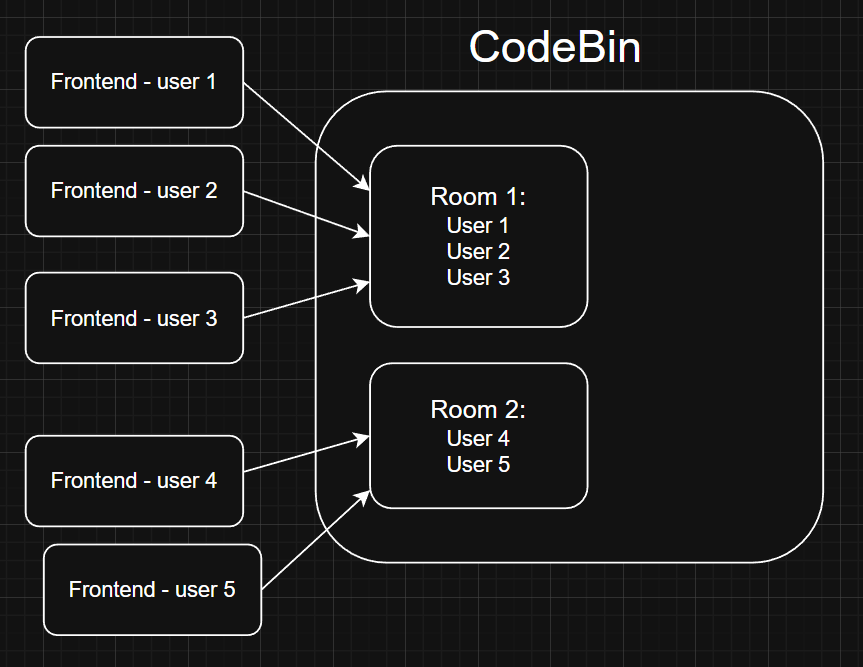

# 🚀 CodeBin - Real Time Collaborative Code Editor
CodeBridge is a real-time collaborative code editor that allows multiple users to write, edit, and execute code together in shared rooms. It focuses on functionality, performance, and real-time collaboration,
## ✨ Features

- **Real-time Collaboration** – Multiple users can edit code simultaneously

- **Room-based Architecture** – Each room is isolated with its own state

- **Duplicate Username Prevention (Race-Condition Safe)** – Usernames are validated server-side at join time. If two users attempt to join a room simultaneously with the same username, only one request is accepted atomically.

- **Multi-Language Support**  – Java, Python, C++

- **Live Code Sync** – Monaco Editor synced via Socket.IO

- **Shared Console / Terminal**

  - Output visible to all users

  - Input shared in real time

- **Dark / Light Theme** – Context-based theme management

- **File Download** – Download current code with correct extension

- **Fast UI** – Minimal, clean, performance-focused design

- **Auto-reconnect Support** – Handled by Socket.IO

# Architecture Diagram

