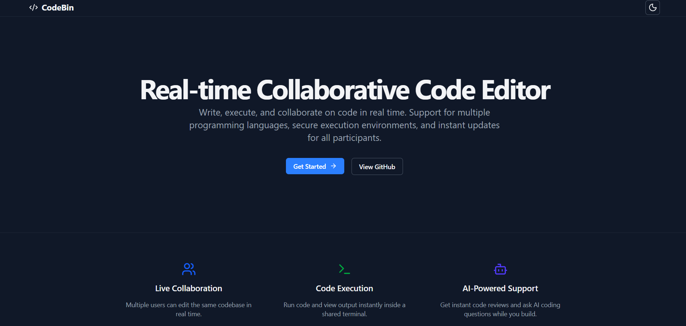
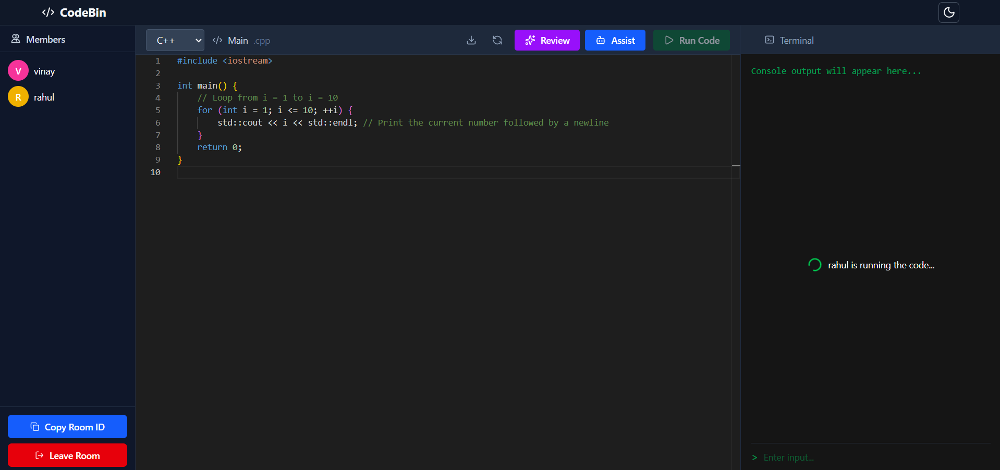

# 🚀 CodeBin - Real Time Collaborative Code Editor
CodeBridge is a real-time collaborative code editor that allows multiple users to write, edit, and execute code together in shared rooms. It focuses on functionality, performance, and real-time collaboration,
## ✨ Features

- **Real-time Collaboration** – Multiple users can edit code simultaneously

- **Room-based Architecture** – Each room is isolated with its own state

- **Duplicate Username Prevention (Race-Condition Safe)** – Usernames are validated server-side at join time. If two users attempt to join a room simultaneously with the same username, only one request is accepted atomically.

- **Multi-Language Support**  – Java, Python, C++

- **Live Code Sync** – Monaco Editor synced via Socket.IO

- **Shared Console / Terminal**

  - Output visible to all users

  - Input shared in real time

- **Dark / Light Theme** – Context-based theme management

- **File Download** – Download current code with correct extension

- **Fast UI** – Minimal, clean, performance-focused design

- **Auto-reconnect Support** – Handled by Socket.IO

# 🏗 Architecture Diagram


## 🚀 Getting Started

### Prerequisites
- Node.js (v16 or later)
- Docker (for code execution feature)
- npm or yarn

### Installation

1. Clone the repository:
```bash
git clone https://github.com/Vinay42/CodeBin
cd codebin
```

2. Install server dependencies:
```bash
cd server
npm install
```

3. Install client dependencies:
```bash
cd ../client
npm install
```

### Configuration

1. Create a `.env` file in the server directory:
```env
PORT = 3001,
BACKEND_URL = "http://localhost:3001",
FRONTEND_ORIGIN = "http://localhost:5173"
```

2. Create a `.env` file in the client directory:
```env
VITE_SOCKET_URL = "http://localhost:3001"
```

### Running the Application

1. Start the server:
```bash
cd server
npm run dev
```

2. Start the client:
```bash
cd client
npm run dev
```

3. Access the application at `http://localhost:5173`

# Demo




